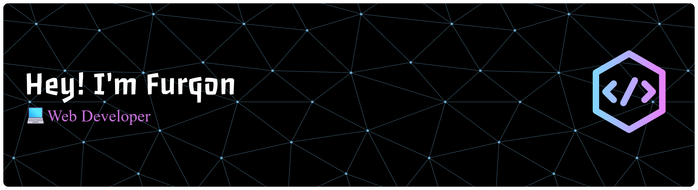

# Hi there 👋

    

###

## 👨‍💻 About Me

Hi! I'm Muhammad Ismatullah Furqon, an Informatics Engineering student at State University of Surabaya. I'm passionate about Web Development, and I enjoy creating modern, responsive, and user-friendly websites.

###

## 🚀 Tech Stack

    

###

## 🎮 My GitHub Activity

<picture>
    <source media="(prefers-color-scheme: dark)" srcset="https://raw.githubusercontent.com/furqonx23/furqonx23/output/pacman-contribution-graph-dark.svg">
    <source media="(prefers-color-scheme: light)" srcset="https://raw.githubusercontent.com/furqonx23/furqonx23/output/pacman-contribution-graph.svg">
    
</picture>

###

    

###
